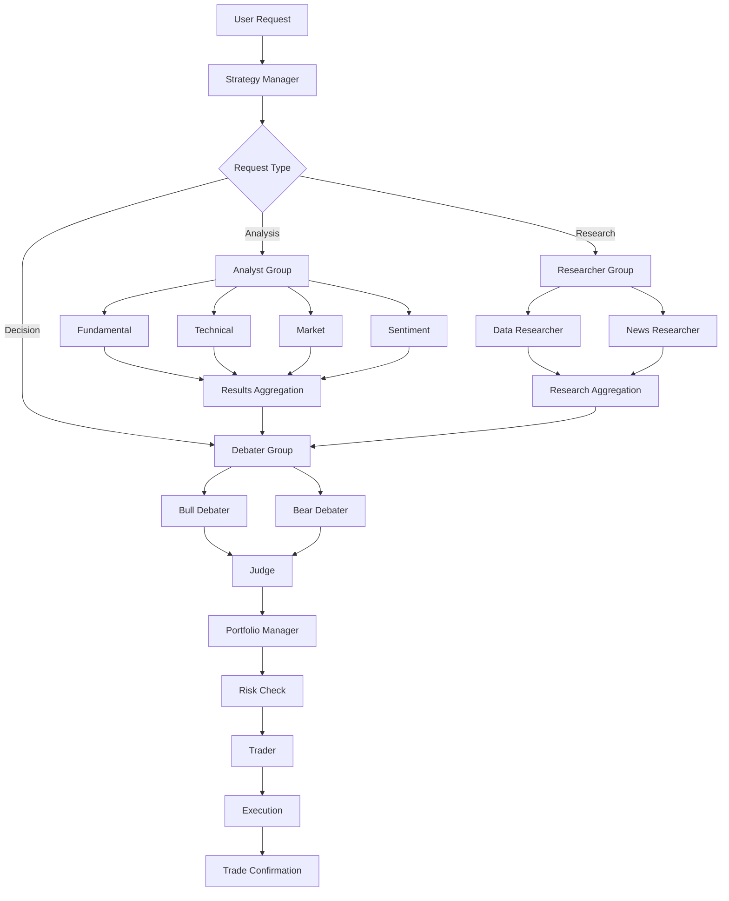

# Multi-Agent Architecture

> TradingAgents-CN 多智能体系统架构设计

## 1. Overview

TradingAgents-CN 采用 **13 Agent** 的多智能体协作架构，包含 4 类角色：

| Category | Count | Agents |
|----------|-------|--------|
| Analysts | 4 | Fundamental, Technical, Market, Sentiment |
| Researchers | 2 | Data Researcher, News Researcher |
| Debaters | 3 | Bull Debater, Bear Debater, Judge |
| Managers | 2 | Strategy Manager, Portfolio Manager |
| Trader | 1 | Trader |

---

## 2. Agent Type Definitions

### 2.1 Analyst Agents

```python
class AnalystType(Enum):
    FUNDAMENTAL = "fundamental_analyst"      # 基本面分析
    TECHNICAL = "technical_analyst"           # 技术分析
    MARKET = "market_analyst"                 # 市场分析
    SENTIMENT = "sentiment_analyst"           # 情绪分析
```

#### Fundamental Analyst
- **Input**: Stock code, financial statements, historical data
- **Output**: Financial health score, valuation metrics, investment thesis
- **Tools**: Financial data APIs, earnings reports, balance sheets

#### Technical Analyst
- **Input**: Price charts, volume data, technical indicators
- **Output**: Trend direction, support/resistance levels, entry/exit points
- **Tools**: K-line patterns, moving averages, RSI, MACD

#### Market Analyst
- **Input**: Sector performance, fund flows, market indices
- **Output**: Sector rotation, market sentiment, capital flow analysis
- **Tools**: Sector ETFs, market breadth indicators

#### Sentiment Analyst
- **Input**: News articles, social media, analyst reports
- **Output**: Sentiment score, news impact assessment, event-driven insights
- **Tools**: News APIs, NLP models, social media scraping

---

### 2.2 Researcher Agents

```python
class ResearcherType(Enum):
    DATA = "data_researcher"                  # 数据研究
    NEWS = "news_reseacher"                   # 新闻研究
```

#### Data Researcher
- **Input**: Data requirements specification
- **Output**: Verified data from multiple sources, quality assessment
- **Tools**: Tushare, AKShare, Alpha Vantage, Finnhub

#### News Researcher
- **Input**: News topic or event
- **Output**: Relevant news articles, summaries, source verification
- **Tools**: News aggregation APIs, web scraping

---

### 2.3 Debater Agents

```python
class DebaterType(Enum):
    BULL = "bull_debater"                    # 多方辩手
    BEAR = "bear_debater"                    # 空方辩手
    JUDGE = "judge"                          # 裁判
```

#### Bull Debater
- **Input**: Stock analysis from analysts
- **Output**: Bullish arguments, positive factors, upside potential
- **Focus**: Risk-reward ratio positive, growth catalysts

#### Bear Debater
- **Input**: Stock analysis from analysts
- **Output**: Bearish arguments, negative factors, downside risks
- **Focus**: Risk-reward ratio negative, red flags, headwinds

#### Judge
- **Input**: Bull and bear arguments
- **Output**: Weighted decision, confidence level, final recommendation
- **Method**: Pros-cons weighting, scenario analysis

---

### 2.4 Manager Agents

```python
class ManagerType(Enum):
    STRATEGY = "strategy_manager"            # 策略管理
    PORTFOLIO = "portfolio_manager"          # 组合管理
```

#### Strategy Manager
- **Input**: User request, market context
- **Output**: Agent orchestration plan, execution schedule
- **Responsibilities**: 
  - Parse user trading requests
  - Determine required agents
  - Coordinate execution order
  - Aggregate results

#### Portfolio Manager
- **Input**: Trading signals, current positions, risk limits
- **Output**: Position adjustments, allocation changes
- **Responsibilities**:
  - Calculate optimal position sizes
  - Enforce risk limits
  - Rebalance portfolio

---

### 2.5 Trader Agent

```python
class TraderType(Enum):
    TRADE = "trader"                         # 交易员
```

#### Trader
- **Input**: Trading decision, execution parameters
- **Output**: Trade confirmation, fill status
- **Responsibilities**:
  - Execute buy/sell orders
  - Apply risk controls
  - Manage order types (market, limit, stop-loss)
  - Monitor execution quality

---

## 3. Communication Protocol

### 3.1 Message Format

```python
@dataclass
class AgentMessage:
    sender: str                    # Agent ID
    receiver: str                  # Agent ID or "broadcast"
    message_type: MessageType      # REQUEST, RESPONSE, ERROR
    content: Dict                  # Message payload
    timestamp: datetime
    conversation_id: str           # For tracing
    parent_id: Optional[str]       # Parent message ID for threading
```

### 3.2 Message Types

| Type | Direction | Description |
|------|-----------|-------------|
| `ANALYSIS_REQUEST` | Manager → Analyst | 请求分析 |
| `ANALYSIS_RESPONSE` | Analyst → Manager | 返回分析结果 |
| `DATA_REQUEST` | Researcher → DataSource | 请求数据 |
| `DEBATE_REQUEST` | Manager → Debater | 请求辩论 |
| `TRADE_REQUEST` | Manager → Trader | 请求交易 |
| `ERROR` | Any → Any | 错误通知 |

---

## 4. Agent Orchestration Flow



---

## 5. State Management

### 5.1 Conversation State

```python
@dataclass
class ConversationState:
    conversation_id: str
    user_id: str
    status: ConversationStatus  # ACTIVE, COMPLETED, FAILED
    current_phase: Phase        # ANALYSIS, DEBATE, EXECUTION
    agents_involved: List[str]
    messages: List[AgentMessage]
    results: Dict[str, Any]     # Agent outputs
    created_at: datetime
    updated_at: datetime
```

### 5.2 Phase Transitions

```
ANALYSIS → DEBATE → EXECUTION → COMPLETED
   ↓           ↓          ↓
  ERROR      ERROR      ERROR
   ↓           ↓          ↓
 FAILED     FAILED     FAILED
```

---

## 6. Error Handling

### 6.1 Retry Strategy

| Error Type | Retry Count | Backoff |
|------------|-------------|---------|
| Network Timeout | 3 | Exponential |
| Rate Limit | 5 | Linear |
| API Error | 2 | Constant |
| Agent Timeout | 1 | None |

### 6.2 Fallback Mechanism

```python
class AgentFallback:
    def handle_failure(self, agent: str, error: Error) -> Any:
        if agent == "fundamental_analyst":
            return self._fallback_to_historical()
        elif agent == "data_researcher":
            return self._fallback_to_cache()
        else:
            raise MaxRetriesExceeded(agent, error)
```

---

## 7. Configuration

### 7.1 Agent Config Schema

```python
@dataclass
class AgentConfig:
    name: str
    type: AgentType
    model: str                          # LLM model identifier
    temperature: float = 0.7
    max_tokens: int = 4096
    timeout: int = 60                   # seconds
    retry_count: int = 3
    system_prompt: str
    tools: List[str]                    # Available tool names
    enabled: bool = True
```

### 7.2 Default Configuration

| Agent | Model | Temperature | Max Tokens |
|-------|-------|-------------|------------|
| Fundamental Analyst | gpt-4o | 0.7 | 4096 |
| Technical Analyst | gpt-4o | 0.7 | 4096 |
| Market Analyst | gpt-4o | 0.7 | 4096 |
| Sentiment Analyst | gpt-4o | 0.7 | 4096 |
| Data Researcher | gpt-4o | 0.3 | 2048 |
| News Researcher | gpt-4o | 0.3 | 2048 |
| Bull/Bear Debater | gpt-4o | 0.8 | 4096 |
| Judge | gpt-4o | 0.5 | 4096 |
| Strategy Manager | gpt-4o | 0.7 | 4096 |
| Portfolio Manager | gpt-4o | 0.5 | 4096 |
| Trader | gpt-4o | 0.3 | 2048 |

---

## 8. API Interface

### 8.1 Agent Execution API

```python
# POST /api/v1/agents/execute
{
    "agent_type": "fundamental_analyst",
    "input": {
        "stock_code": "000001.SZ",
        "analysis_type": "full",
        "time_horizon": "medium"
    },
    "config": {
        "temperature": 0.7,
        "max_tokens": 4096
    }
}

# Response
{
    "success": true,
    "execution_id": "exec_xxx",
    "output": {
        "financial_score": 0.75,
        "valuation": {...},
        "investment_thesis": "..."
    },
    "metadata": {
        "execution_time": 12.5,
        "model_used": "gpt-4o"
    }
}
```

---

## 9. Implementation Notes

### 9.1 Key Files

| File | Purpose |
|------|---------|
| `tradingagents/agents/__init__.py` | Agent type definitions |
| `tradingagents/agents/analysts/*.py` | Analyst implementations |
| `tradingagents/agents/researchers/*.py` | Researcher implementations |
| `tradingagents/agents/debaters/*.py` | Debater implementations |
| `tradingagents/agents/managers/*.py` | Manager implementations |
| `tradingagents/agents/trader/*.py` | Trader implementation |
| `tradingagents/core/orchestrator.py` | Agent orchestration engine |

### 9.2 Known Constraints

- A股/港股数据源仅支持环境变量读取 API Key（待支持数据库配置）
- 美股数据源已支持数据库配置读取
- 研究员 Agent 暂时不支持流式输出
