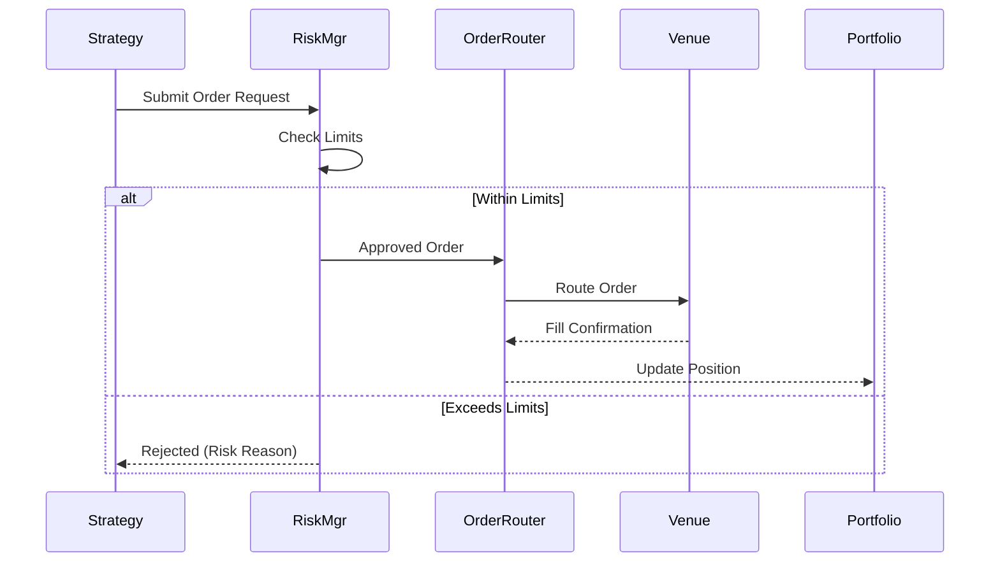

# Trading Strategy

> TradingAgents-CN 交易策略设计

## 1. Overview

交易策略模块负责根据分析结果生成交易决策，并执行交易指令。

```
┌─────────────────────────────────────────────────────────────┐
│                    Trading Strategy System                      │
├─────────────────────────────────────────────────────────────┤
│                                                              │
│  ┌────────────────────────────────────────────────────────┐ │
│  │              Strategy Decision Engine                     │ │
│  │  - Signal Processing                                     │ │
│  │  - Position Sizing                                       │ │
│  │  - Risk Assessment                                       │ │
│  └─────────────────────────┬──────────────────────────────┘ │
│                            ↓                                  │
│  ┌─────────────────────────┴──────────────────────────────┐ │
│  │                   Risk Management                         │ │
│  │  - Position Limits                                       │ │
│  │  - Stop Loss                                             │ │
│  │  - Drawdown Control                                      │ │
│  └─────────────────────────┬──────────────────────────────┘ │
│                            ↓                                  │
│  ┌─────────────────────────┴──────────────────────────────┐ │
│  │                   Order Execution                        │ │
│  │  - Order Type (Market/Limit/Stop)                      │ │
│  │  - Execution Venue                                       │ │
│  │  - Fill Tracking                                         │ │
│  └────────────────────────────────────────────────────────┘ │
└─────────────────────────────────────────────────────────────┘
```

---

## 2. Strategy Decision Engine

### 2.1 Decision Flow

```python
class StrategyDecisionEngine:
    def make_decision(
        self,
        analysis: FusedResult,
        portfolio: Portfolio,
        market_context: MarketContext
    ) -> TradingDecision:
        
        # Step 1: Signal Generation
        signal = self._generate_signal(analysis)
        
        # Step 2: Position Sizing
        position_size = self._calculate_position_size(
            signal, portfolio, market_context
        )
        
        # Step 3: Risk Assessment
        risk_result = self._assess_risk(
            signal, position_size, portfolio
        )
        
        if not risk_result.approved:
            return TradingDecision(
                action=HOLD,
                reason=risk_result.rejection_reason,
                risk_metrics=risk_result.metrics
            )
        
        # Step 4: Generate Order
        order = self._create_order(signal, position_size)
        
        return TradingDecision(
            action=signal.action,
            order=order,
            confidence=analysis.confidence,
            risk_metrics=risk_result.metrics
        )
```

### 2.2 Signal Types

| Signal | Action | Description |
|--------|--------|-------------|
| STRONG_BUY | BUY 100% | 强烈买入信号 |
| BUY | BUY 50-70% | 买入信号 |
| HOLD | NO_ACTION | 持有 |
| SELL | SELL 50-70% | 卖出信号 |
| STRONG_SELL | SELL 100% | 强烈卖出信号 |

---

## 3. Position Sizing

### 3.1 Sizing Methods

```python
class PositionSizer:
    """仓位计算器"""
    
    def calculate(
        self,
        signal: Signal,
        portfolio: Portfolio,
        method: SizingMethod = SizingMethod.KELLY
    ) -> PositionSize:
        
        if method == SizingMethod.KELLY:
            return self._kelly_sizing(signal, portfolio)
        elif method == SizingMethod.EQUAL_WEIGHT:
            return self._equal_weight_sizing(signal, portfolio)
        elif method == SizingMethod.RISK_PARITY:
            return self._risk_parity_sizing(signal, portfolio)
        elif method == SizingMethod.VOLATILITY_ADJUSTED:
            return self._volatility_adjusted_sizing(signal, portfolio)
    
    def _kelly_sizing(
        self, signal: Signal, portfolio: Portfolio
    ) -> PositionSize:
        """
        Kelly Criterion: f* = (bp - q) / b
        where:
          f* = fraction of portfolio to bet
          b = odds received on the bet
          p = probability of winning
          q = probability of losing = 1 - p
        """
        # 简化 Kelly，实际使用半 Kelly 或四分之一 Kelly
        win_rate = signal.win_rate or 0.55
        avg_gain = signal.avg_gain or 0.10
        avg_loss = signal.avg_loss or 0.05
        
        odds = avg_gain / avg_loss
        p = win_rate
        q = 1 - win_rate
        
        kelly_fraction = (odds * p - q) / odds
        
        # 使用半 Kelly 降低波动
        actual_fraction = kelly_fraction * 0.5
        
        # 限制最大仓位
        max_fraction = portfolio.max_position_size
        actual_fraction = min(actual_fraction, max_fraction)
        
        return PositionSize(
            fraction=actual_fraction,
            method="kelly_half",
            kelly_original=kelly_fraction,
            max_risk=avg_loss * actual_fraction
        )
    
    def _volatility_adjusted_sizing(
        self, signal: Signal, portfolio: Portfolio
    ) -> PositionSize:
        """
        根据波动率调整仓位
        目标：每个头寸对组合波动的贡献相同
        """
        stock_vol = signal.volatility or 0.20
        target_vol = portfolio.target_volatility or 0.15
        
        # 波动率调整因子
        vol_adjustment = target_vol / stock_vol
        
        # Kelly 结果
        kelly_result = self._kelly_sizing(signal, portfolio)
        
        # 结合 Kelly 和波动率调整
        adjusted_fraction = kelly_result.fraction * vol_adjustment
        
        return PositionSize(
            fraction=min(adjusted_fraction, kelly_result.fraction),
            method="volatility_adjusted_kelly",
            volatility=stock_vol,
            vol_adjustment_factor=vol_adjustment
        )
```

### 3.2 Position Size Constraints

| Constraint | Value | Description |
|-----------|-------|-------------|
| Max Single Position | 20% | 单只股票最大仓位 |
| Min Single Position | 1% | 单只股票最小仓位 |
| Max Sector | 40% | 单个板块最大仓位 |
| Max Leverage | 1.0x | 不使用杠杆 |
| Cash Reserve | 5% | 最低现金储备 |

---

## 4. Risk Management

### 4.1 Risk Metrics

```python
@dataclass
class RiskMetrics:
    # VaR (Value at Risk)
    var_1d: float           # 1-day VaR at 95% confidence
    var_5d: float           # 5-day VaR at 95% confidence
    
    # Drawdown
    current_drawdown: float # 当前回撤
    max_drawdown: float     # 历史最大回撤
    
    # Exposure
    net_exposure: float     # 净敞口
    gross_exposure: float   # 总敞口
    sector_exposure: Dict[str, float]  # 板块敞口
    
    # Greeks (if applicable)
    beta: float             # Beta
    correlation: float      # 与指数相关性
```

### 4.2 Risk Limits

```python
RISK_LIMITS = {
    "max_portfolio_var": 0.05,           # 组合 VaR <= 5%
    "max_single_loss": 0.02,             # 单笔最大亏损 2%
    "max_daily_loss": 0.03,              # 日内最大亏损 3%
    "max_drawdown": 0.15,                # 最大回撤 15%
    "min_cash_ratio": 0.05,              # 最低现金比例 5%
    "max_sector_concentration": 0.40,     # 最大板块集中度 40%
}
```

### 4.3 Stop Loss Strategy

```python
class StopLossManager:
    def calculate_stop_loss(
        self,
        entry_price: float,
        signal: Signal,
        method: StopLossMethod
    ) -> StopLossLevel:
        
        if method == StopLossMethod.FIXED:
            return self._fixed_stop_loss(entry_price, 0.05)
        
        elif method == StopLossMethod.TRAILING:
            return self._trailing_stop_loss(entry_price, signal)
        
        elif method == StopLossMethod.ATR:
            return self._atr_stop_loss(entry_price, signal)
        
        elif method == StopLossMethod.STRUCTURE:
            return self._structure_stop_loss(entry_price, signal)
    
    def _atr_stop_loss(
        self, entry_price: float, signal: Signal
    ) -> StopLossLevel:
        """
        ATR-based stop loss
        Stop = Entry - N * ATR
        N typically 2-3
        """
        atr = signal.atr or (entry_price * 0.02)  # fallback
        n = 2.5
        
        stop_price = entry_price - n * atr
        
        return StopLossLevel(
            stop_price=stop_price,
            risk_reward_ratio=(entry_price - stop_price) / (signal.target_price - entry_price),
            method="atr",
            atr_value=atr,
            atr_multiplier=n
        )
```

---

## 5. Order Execution

### 5.1 Order Types

```python
class OrderType(Enum):
    MARKET = "market"           # 市价单
    LIMIT = "limit"             # 限价单
    STOP = "stop"               # 止损单
    STOP_LIMIT = "stop_limit"   # 止损限价单
    TWAP = "twap"              # 时间加权平均
    VWAP = "vwap"              # 成交量加权平均
```

### 5.2 Order Router

```python
class OrderRouter:
    def route_order(
        self,
        order: Order,
        available_venues: List[Venue]
    ) -> RoutedOrder:
        
        # Select best venue based on:
        # 1. Execution quality (fill rate, spread, impact)
        # 2. Commission
        # 3. Latency
        # 4. Stock availability
        
        best_venue = self._select_venue(order, available_venues)
        
        return RoutedOrder(
            original_order=order,
            venue=best_venue,
            routed_time=datetime.now()
        )
    
    def _select_venue(
        self, order: Order, venues: List[Venue]
    ) -> Venue:
        scores = []
        
        for venue in venues:
            score = 0
            score += venue.fill_rate * 40
            score += (1 / (venue.commission + 0.0001)) * 20
            score += venue.liquidity_score * 30
            score += (1 / venue.latency_ms) * 10
            scores.append((venue, score))
        
        return max(scores, key=lambda x: x[1])[0]
```

### 5.3 Execution Flow



---

## 6. Portfolio Manager Integration

### 6.1 Rebalancing Trigger

```python
class PortfolioRebalancer:
    TRIGGERS = {
        "quarterly": 90,      # 每季度再平衡
        "threshold": 0.05,     # 偏离阈值 5%
        "daily": 1,           # 每日检查
    }
    
    def should_rebalance(self, portfolio: Portfolio) -> bool:
        # Check threshold-based rebalancing
        for position in portfolio.positions:
            target = position.target_allocation
            current = position.current_allocation
            
            if abs(current - target) > self.TRIGGERS["threshold"]:
                return True
        
        # Check time-based rebalancing
        if self._days_since_rebalance() >= self.TRIGGERS["quarterly"]:
            return True
        
        return False
```

---

## 7. Strategy Performance

### 7.1 Metrics

| Metric | Formula | Target |
|--------|---------|--------|
| Total Return | (End - Start) / Start | > Benchmark |
| Sharpe Ratio | Return / Volatility | > 1.5 |
| Max Drawdown | Peak - Trough | < 15% |
| Win Rate | Wins / Total | > 50% |
| Avg Win/Loss | Mean Win / Mean Loss | > 1.5 |
| Calmar Ratio | Return / Max DD | > 1.0 |

---

## 8. API Reference

### 8.1 Submit Trade Request

```python
# POST /api/v1/trades

{
    "stock_code": "000001.SZ",
    "action": "BUY",
    "order_type": "limit",
    "price": 12.50,           # For limit orders
    "quantity": 1000,
    "signal_id": "sig_xxx",   # From analysis
    "stop_loss": 11.75,       # Optional
    "take_profit": 14.00,     # Optional
    "strategy_id": "strat_default",
    "notes": "Based on Q1 earnings beat"
}

# Response
{
    "success": True,
    "trade_id": "trd_xxx",
    "status": "SUBMITTED",
    "order": {
        "order_id": "ord_xxx",
        "stock_code": "000001.SZ",
        "action": "BUY",
        "quantity": 1000,
        "price": 12.50,
        "filled": 0,
        "remaining": 1000
    },
    "risk_check": {
        "approved": True,
        "var_impact": 0.002,
        "new_exposure": 0.12
    }
}
```

---

## 9. Implementation Notes

### 9.1 Key Files

| File | Purpose |
|------|---------|
| `tradingagents/agents/trader/*.py` | Trader Agent 实现 |
| `tradingagents/strategies/*.py` | 策略实现 |
| `tradingagents/risk/*.py` | 风控模块 |
| `tradingagents/orders/*.py` | 订单管理 |
| `app/core/portfolio_manager.py` | 组合管理器 |

### 9.2 Current Limitations

- 模拟交易为主，实盘对接正在开发
- 执行Venue仅支持券商API（待扩展）
- 暂不支持期权/期货策略
